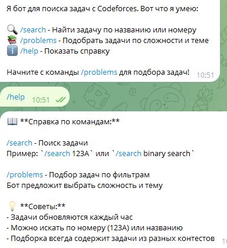
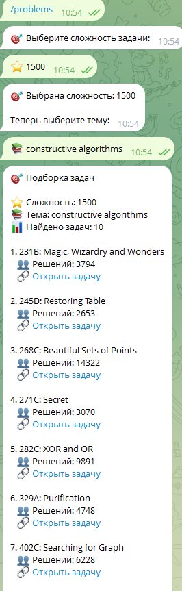

# Codeforces Problems Bot

Telegram бот для поиска и подбора задач с Codeforces с возможностью фильтрации по сложности и темам.

## 📋 Оглавление

- [Функциональность](#-функциональность)
- [Технологии](#-технологии)
- [Архитектура](#-архитектура)
- [Установка и запуск](#-установка-и-запуск)
- [Конфигурация](#-конфигурация)
- [Использование](#-использование)
- [API](#-api)
- [Тестирование](#-тестирование)
- [Разработка](#-разработка)

## 🚀 Функциональность

### Основные возможности:
- **Парсинг задач** с Codeforces с автоматическим обновлением каждый час
- **Поиск задач** по названию или номеру (например, "123A")
- **Подбор задач** по сложности и темам
- **Статистика** по количеству решений и сложности
- **Автообновление** базы данных

### Команды бота:
- `/start` - Начало работы с ботом
- `/help` - Справка по командам
- `/search <запрос>` - Поиск задач
- `/problems` - Подбор задач по фильтрам

### Пример взаимодействия:

    User: /problems
    Bot:  Выберите сложность задачи:
         [ 800] [ 900] [ 1000] [ 1100] [ 1200]
    
    User:  1200
    Bot:  Выбрана сложность: 1200
         Теперь выберите тему:
         [ dp] [ math] [ greedy] [ graphs]
    
    User:  dp
    Bot:  Подборка задач
          Сложность: 1200
          Тема: dp
          Найдено задач: 10
    
         1. **123A**: Test Problem
             Решений: 1500
             https://codeforces.com/problemset/problem/123/A




## Технологии

- **Python 3.11+** - основной язык разработки
- **PostgreSQL** - база данных
- **SQLAlchemy** - ORM для работы с БД
- **Docker & Docker Compose** - контейнеризация
- **Telegram Bot API** - интеграция с Telegram
- **APScheduler** - планировщик задач
- **Pytest** - тестирование
- **Requests** - HTTP-запросы

## Архитектура
    src/
    ├── bot/ # Telegram бот
    │ ├── telegram_bot.py # Основной класс бота
    │ └── handlers.py # Обработчики команд
    ├── parser/ # Парсер Codeforces
    │ ├── codeforces_parser.py
    │ └── scheduler.py # Планировщик обновлений
    ├── database/ # Работа с БД
    │ ├── database.py # Подключение к БД
    │ └── models.py # Модели данных
    ├── services/ # Бизнес-логика
    │ └── task_services.py # Сервис задач
    └── config/ # Конфигурация
    └── config.py # Настройки приложения

##  Установка и запуск

### Предварительные требования:
- Docker и Docker Compose
- Python 3.11+ (для разработки)
- Telegram Bot Token

### Быстрый запуск:

1. **Клонируйте репозиторий:**
```bash
git clone <https://github.com/KirsanV/diplodoc>
```
2.  **Отредактируйте .env.sample под ваши значения**
3.  **После редактирования запускайте бота**
4.  **Для запуска через докер(скрипт) """python docker_manager.py start"""**
5.  **Базовый скрипт """python src/main.py""""**
6.  **Также для ручного управления вкл\выкл можно использовать """python run_parser"""**

## Тестирование
Текущее покрытие тестами: 88%

## Запуск тестов
    pytest

## Запуск тестов с покрытием
    pytest --cov=src --cov-report=term-missing --cov-report=html

